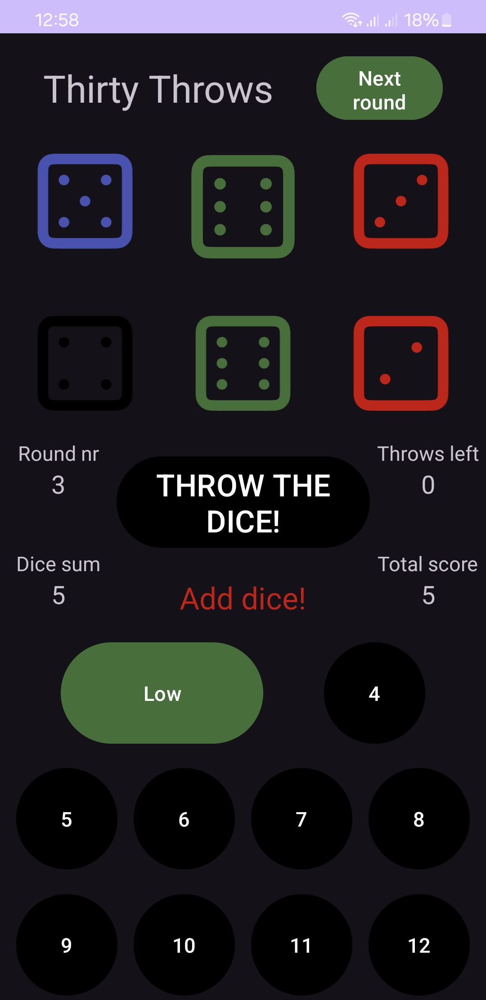

<!-- PROJECT SHIELDS -->
[![Contributors][contributors-shield]][contributors-url]
[![Forks][forks-shield]][forks-url]
[![Stargazers][stars-shield]][stars-url]
[![Issues][issues-shield]][issues-url]
[![MIT License][license-shield]][license-url]
[![LinkedIn][linkedin-shield]][linkedin-url]

<!-- PROJECT LOGO -->
 

<!--   -->

<h3 align="center">ThirtyGame</h3>

  

    An android app, implementing a basic version of the dice game "Thirty".
     
    <a href="https://github.com/mavosy/ThirtyGame"><strong>Explore the docs »</strong></a>
     
     
    <a href="https://github.com/mavosy/ThirtyGame/issues/new?labels=bug&template=bug-report---.md">Report Bug</a>
    ·
    <a href="https://github.com/mavosy/ThirtyGame/issues/new?labels=enhancement&template=feature-request---.md">Request Feature</a>
  

<!-- TABLE OF CONTENTS -->

  
Table of Contents

  <ol>
    <li>
      <a href="#about-the-project">About The Project</a>
      <ul>
        <li><a href="#built-with">Built With</a></li>
      </ul>
    </li>
    <li>
      <a href="#getting-started">Getting Started</a>
      <ul>
        <li><a href="#prerequisites">Prerequisites</a></li>
        <li><a href="#installation">Installation</a></li>
      </ul>
    </li>
    <li><a href="#usage">Usage</a></li>
    <li><a href="#roadmap">Roadmap</a></li>
    <li><a href="#license">License</a></li>
    <li><a href="#contact">Contact</a></li>
  </ol>

<!-- ABOUT THE PROJECT -->
## About The Project

  

 

**ThirtyGame** is an Android-based mobile application written in Kotlin. The app is a practice project for building a basic implementation of the dice game "Thirty", 
and is used as an exploration of Android application development concepts, including MVVM architecture, repository patterns, data binding, 
and Kotlin Coroutines.

The game allows players to roll dice and accumulate scores across rounds, focusing on different score combinations, like collecting threes, fives, or full sets,
which are then saved and displayed in UI, not dissimilar to Yatzy.

(<a href="#readme-top">back to top</a>)

### Built With

* [![Kotlin][kotlin-shield]][kotlin-url]
* [![Android][android-shield]][android-url]
* MVVM Pattern

(<a href="#readme-top">back to top</a>)

<!-- GETTING STARTED -->
## Getting Started

Follow these steps to get a local copy up and running.

### Prerequisites

- .NET 6.0 SDK or later
- Visual Studio 2022 or another IDE with WPF support

### Installation

1. Install Android Studio.
2. Make sure you have the necessary Android SDKs installed (API 29 or higher recommended).
3. Open the project in Android Studio.
4. Sync the project to download necessary dependencies.
5. Run the application on an emulator or physical device.

(<a href="#readme-top">back to top</a>)

<!-- USAGE EXAMPLES -->
## Usage

1. Launch the application.
2. Roll the dice and select which scoring category you want to apply the roll towards (e.g., sum of threes, fives, etc.).
3. Continue playing through multiple rounds until the game is completed and a final score is displayed.

(<a href="#readme-top">back to top</a>)

<!-- ROADMAP -->
## Roadmap

- [ ] Better replayability, game shuts of after one game
- [ ] High-score system with local database
- [ ] Unit tests
- [ ] UI tests
- [ ] Refactor code for readability

See the [open issues](https://github.com/mavosy/ThirtyGame/issues) for a full list of proposed features (and known issues).

(<a href="#readme-top">back to top</a>)

<!-- CONTRIBUTING -->
## Contributing

Contributions are what make the open source community such an amazing place to learn, inspire, and create. Any contributions you make are **greatly appreciated**.

If you have a suggestion that would make this better, please fork the repo and create a pull request. You can also simply open an issue with the tag "enhancement".
Don't forget to give the project a star! Thanks again!

1. Fork the Project
2. Create your Feature Branch (`git checkout -b feature/AmazingFeature`)
3. Commit your Changes (`git commit -m 'Add some AmazingFeature'`)
4. Push to the Branch (`git push origin feature/AmazingFeature`)
5. Open a Pull Request

(<a href="#readme-top">back to top</a>)

### Top contributors:

<!-- LICENSE -->
## License

Distributed under the MIT License. See `LICENSE.txt` for more information.

(<a href="#readme-top">back to top</a>)

<!-- CONTACT -->
## Contact

mavosy - maltesydow@gmail.com

Project Link: [https://github.com/mavosy/ThirtyGame](https://github.com/mavosy/ThirtyGame)

(<a href="#readme-top">back to top</a>)

<!-- MARKDOWN LINKS & IMAGES -->
<!-- https://www.markdownguide.org/basic-syntax/#reference-style-links -->
[contributors-shield]: https://img.shields.io/github/contributors/mavosy/ThirtyGame.svg?style=for-the-badge
[contributors-url]: https://github.com/mavosy/ThirtyGame/graphs/contributors
[forks-shield]: https://img.shields.io/github/forks/mavosy/ThirtyGame.svg?style=for-the-badge
[forks-url]: https://github.com/mavosy/ThirtyGame/network/members
[stars-shield]: https://img.shields.io/github/stars/mavosy/ThirtyGame.svg?style=for-the-badge
[stars-url]: https://github.com/mavosy/ThirtyGame/stargazers
[issues-shield]: https://img.shields.io/github/issues/mavosy/ThirtyGame.svg?style=for-the-badge
[issues-url]: https://github.com/mavosy/ThirtyGame/issues
[license-shield]: https://img.shields.io/github/license/mavosy/ThirtyGame.svg?style=for-the-badge
[license-url]: https://github.com/mavosy/ThirtyGame/blob/master/LICENSE.txt
[linkedin-shield]: https://img.shields.io/badge/-LinkedIn-black.svg?style=for-the-badge&logo=linkedin&colorB=555
[linkedin-url]: https://linkedin.com/in/malte-von-sydow
[kotlin-shield]: https://img.shields.io/badge/Kotlin-%237F52FF.svg?logo=kotlin&logoColor=white
[kotlin-url]: https://kotlinlang.org/docs/home.html
[android-shield]: https://img.shields.io/badge/Android-3DDC84?logo=android&logoColor=white
[android-url]: https://developer.android.com/
